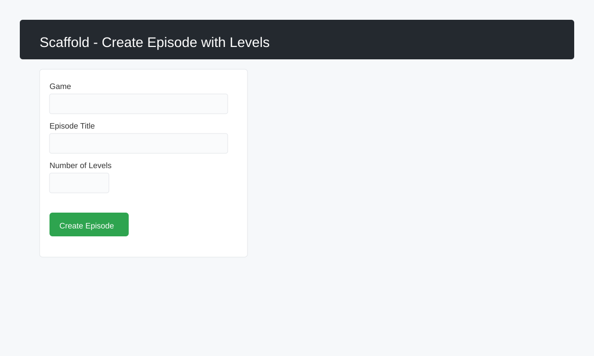
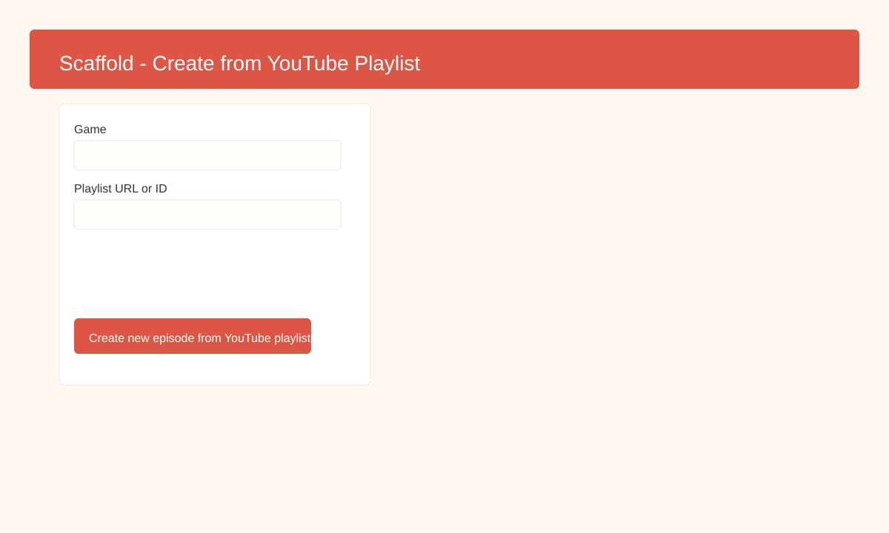
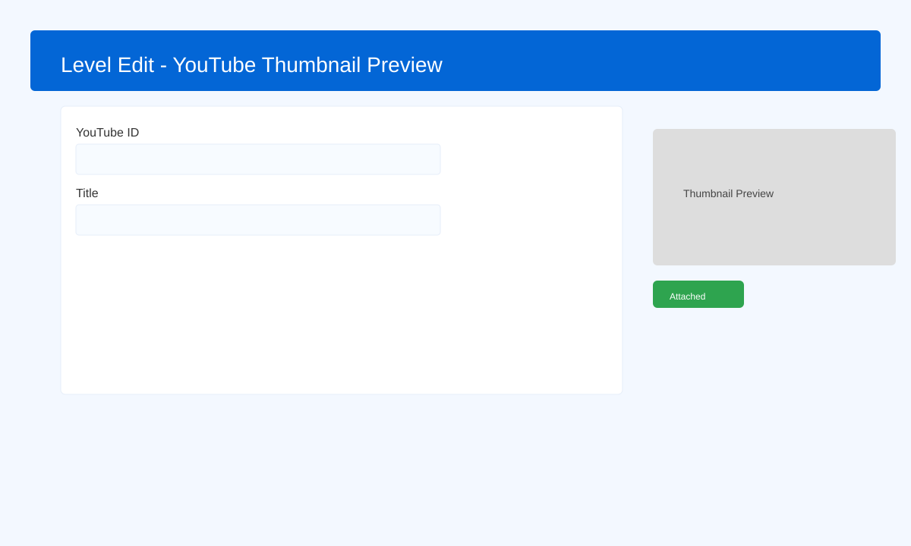

# DerekBell Games Plugin

## Overview

The DerekBell Games Plugin is a comprehensive content management system for game walkthrough websites built on Winter CMS. It provides a structured approach to managing games, episodes, and individual level guides with YouTube video integration.

## Features

- **Hierarchical Content Structure**: Organize content as Games → Episodes → Levels
- **YouTube Integration**: Automatic thumbnail fetching and attachment for video walkthroughs
- **Performance Optimization**: Built-in caching system with automatic invalidation
- **Database Indexing**: Optimized queries for fast content retrieval
- **Frontend Components**: Ready-to-use components for displaying games, episodes, and levels
- **Validation & Security**: Comprehensive validation rules and mass assignment protection
- **Background Jobs**: Queue-based YouTube thumbnail processing
- **Query Scopes**: Easy filtering for published and promoted content
- **Console Commands**: Cache management via Artisan commands

## Installation

1. Clone or download the plugin to `/plugins/derekbell/games/`
2. Run migrations:
   ```bash
   php artisan winter:up
   ```
3. The plugin will create three main tables:
   - `derekbell_games_games`
   - `derekbell_games_episodes`
   - `derekbell_games_levels`

## Database Structure

### Games Table
- `id` - Primary key
- `title` - Game title
- `slug` - URL-friendly identifier (auto-generated from title)
- `excerpt` - Short description
- `description` - Full description
- `is_published` - Visibility flag
- `is_promoted` - Featured status
- `sort_order` - Display order
- `logo` - Attached file (SVG recommended)
- `created_at` - Timestamp when record was created (auto-managed)
- `updated_at` - Timestamp when record was last updated (auto-managed)
- `deleted_at` - Timestamp when record was soft deleted (nullable)

### Episodes Table
- `id` - Primary key
- `game_id` - Foreign key to games
- `title` - Episode title
- `slug` - URL-friendly identifier (auto-generated from title)
- `start_level` - First level number
- `end_level` - Last level number
- `episode_number` - Episode sequence
- `excerpt` - Short description
- `description` - Full description
- `is_published` - Visibility flag
- `is_promoted` - Featured status
- `sort_order` - Display order
- `created_at` - Timestamp when record was created (auto-managed)
- `updated_at` - Timestamp when record was last updated (auto-managed)
- `deleted_at` - Timestamp when record was soft deleted (nullable)

### Levels Table
- `id` - Primary key
- `episode_id` - Foreign key to episodes
- `title` - Level title
- `slug` - URL-friendly identifier (auto-generated from title)
- `level_number` - Level sequence number
- `episode_number` - Parent episode number
- `youtube_id` - YouTube video ID (11 characters)
- `excerpt` - Short description
- `description` - Full walkthrough content
- `is_published` - Visibility flag
- `is_promoted` - Featured status
- `sort_order` - Display order
- `youtube_thumbnail` - Attached thumbnail image
- `created_at` - Timestamp when record was created (auto-managed)
- `updated_at` - Timestamp when record was last updated (auto-managed)
- `deleted_at` - Timestamp when record was soft deleted (nullable)

## Models

### Games Model
```php
DerekBell\Games\Models\Games
```

**Relationships:**
- `hasMany` → Episodes

**Scopes:**
- `isPublished()` - Filter published games
- `isPromoted()` - Filter promoted games

### Episodes Model
```php
DerekBell\Games\Models\Episodes
```

**Relationships:**
- `belongsTo` → Game
- `hasMany` → Levels

**Scopes:**
- `isPublished()` - Filter published episodes
- `isPromoted()` - Filter promoted episodes

### Levels Model
```php
DerekBell\Games\Models\Levels
```

**Relationships:**
- `belongsTo` → Episode

**Scopes:**
- `isPublished()` - Filter published levels
- `isPromoted()` - Filter promoted levels

**Accessors:**
- `game` - Access parent game through episode

## Timestamps

All models automatically manage timestamp fields using Laravel's built-in timestamp functionality.

### Automatic Timestamp Fields

**`created_at`** - Carbon instance
- Automatically set when a record is created
- Never updated after initial creation
- Useful for tracking record age and sorting by creation date

**`updated_at`** - Carbon instance
- Automatically set when a record is created
- Updated every time the record is modified
- Useful for cache invalidation and tracking recent changes

**`deleted_at`** - Carbon instance (nullable)
- Part of the SoftDelete trait
- Set when a record is soft deleted
- Records with this value are automatically excluded from queries
- Allows for data recovery and maintains referential integrity

### Working with Timestamps

```php
// Create a new game (timestamps set automatically)
$game = Games::create([
    'title' => 'New Game',
    'is_published' => true
]);
// $game->created_at and $game->updated_at are now set

// Update a game (updated_at changed automatically)
$game->title = 'Updated Title';
$game->save();
// $game->updated_at is now updated

// Access timestamps
echo $game->created_at->diffForHumans(); // "2 hours ago"
echo $game->updated_at->format('Y-m-d H:i:s'); // "2026-01-22 14:30:00"

// Query using timestamps
$recentGames = Games::where('created_at', '>', now()->subDays(7))->get();
$recentlyUpdated = Games::where('updated_at', '>', now()->subHours(24))->get();

// Soft delete (sets deleted_at)
$game->delete();
// $game->deleted_at is now set

// Query soft deleted records
$deleted = Games::onlyTrashed()->get();
$all = Games::withTrashed()->get();

// Restore soft deleted record
$game->restore();
// $game->deleted_at is now null
```

### Disabling Automatic Timestamps

If needed for specific operations, you can temporarily disable timestamps:

```php
$game->timestamps = false;
$game->title = 'Updated without touching timestamps';
$game->save();
```

### Touching Parent Timestamps

When a related model is updated, you can automatically update the parent's `updated_at`:

```php
// In Levels model (add this to relationships if needed)
protected $touches = ['episode'];

// Now when a level is updated, its episode's updated_at is also updated
$level->description = 'New description';
$level->save(); // Both level and episode updated_at are updated
```

## Components

### GamesMenu Component
Displays a list of published games with logos.

**Usage:**
```twig

```

**Properties:** None

**Page Variables:**
- `games` - Collection of published games

### DisplayLevels Component
Shows levels for a specific game episode.

**Usage:**
```twig

```

**Properties:** None (uses URL parameters)

**Page Variables:**
- `levels` - Collection of episode levels

**URL Pattern:**
```
/game/:game/:episode
```

### FrontPageLevels Component
Displays recent or featured levels on the homepage.

**Usage:**
```twig

```

**Properties:**
- `levelCount` - Number of levels to display (default: 12, 0 = featured only)

**Page Variables:**
- `levels` - Collection of levels with eager-loaded relationships

## Caching System

### Overview
The plugin implements a sophisticated caching system to improve performance and reduce database queries.

### Cache Durations
- **Games List**: 60 minutes
- **Episodes List**: 30 minutes
- **Levels List**: 15 minutes

### Cache Keys
```php
// Games
'games.published.list'

// Episodes by game
'episodes.game.{gameId}'

// Front page levels
'levels.frontpage.{count}'

// Episode levels
'levels.episode.{episodeId}'
```

### Automatic Cache Invalidation
Caches are automatically cleared when:
- A game is created, updated, or deleted
- An episode is created, updated, or deleted
- A level is created, updated, or deleted

### Manual Cache Clearing

**Clear all caches:**
```bash
php artisan games:clear-cache --all
```

**Clear specific caches:**
```bash
php artisan games:clear-cache --games
php artisan games:clear-cache --levels
php artisan games:clear-cache --episodes
```

### CacheHelper Class
Use the `CacheHelper` class for programmatic cache management:

```php
use DerekBell\Games\Helpers\CacheHelper;

// Clear all caches
CacheHelper::clearAllCaches();

// Clear games cache
CacheHelper::clearGamesCaches();

// Clear episodes cache for a specific game
CacheHelper::clearEpisodesCaches($gameId);

// Clear levels cache
CacheHelper::clearLevelsCaches($episodeId);

// Get cache keys
$key = CacheHelper::getGamesListKey();
$key = CacheHelper::getEpisodesListKey($gameId);
$key = CacheHelper::getFrontPageLevelsKey($count);
```

## YouTube Integration

### Overview ✅
YouTube support is improved to make it easy to accept full YouTube URLs or raw IDs, automatically normalize them, fetch thumbnails, and attach them to `Level` records.

> Note: The `Levels` model will **normalize** `youtube_id` values (accepts watch URLs, youtu.be, embed, shorts, or raw IDs) on save.

### Automatic Thumbnail Fetching
When a level has a `youtube_id` set, the plugin can automatically fetch and attach the video thumbnail. Thumbnails are used in:
- **Backend**: Level update form shows a thumbnail preview and the levels list includes a thumbnail column.
- **Background jobs**: Thumbnail fetching and attachment can run as background jobs.

### YouTube Helper Methods
```php
use DerekBell\Games\Helpers\YoutubeHelper;

$youtube = new YoutubeHelper();

// Convert a YouTube URL (or ID) to a normalized 11-character video id
$videoId = $youtube->extractVideoId($urlOrId);

// Validate an ID
$isValid = $youtube->isValidYoutubeId($videoId);

// Check whether the video exists on YouTube
$exists = $youtube->checkIdExists($videoId);

// Download the thumbnail file (tries maxresdefault, falls back to standard)
$file = $youtube->getThumbnailFile($videoId);

// Persist a thumbnail file to storage (helper)
$youtube->putFileInStorage($fileContents, $videoId);

// Attach a thumbnail to a level by id
$youtube->attachYoutubeThumbnail($levelId, $file);

// Convenience: fetch and attach thumbnail from the level's youtube_id
$youtube->attachYoutubeThumbnailFromId($levelId);
```

### Example: normalize and attach on save
```php
// Called from a controller or model
$youtube = new YoutubeHelper();
$videoId = $youtube->extractVideoId($request->input('youtube_id'));
if ($videoId && $youtube->checkIdExists($videoId)) {
    $file = $youtube->getThumbnailFile($videoId);
    $youtube->attachYoutubeThumbnail($level->id, $file);
}
```

### Background Job
YouTube thumbnails are processed via the `AttachYoutubeThumbnail` job with:
- **Retry attempts**: 3
- **Retry delay**: 60 seconds
- **Error logging**: Automatic failure logging

## Scaffolding Episodes ✅
The plugin provides two backend tools for quickly creating new episodes and levels.

### 1) Scaffold Episode with Levels
- **Location (Backend):** Content → Games → Scaffold → "Create Episode with Levels" or visit `/backend/derekbell/games/scaffold`
- **Fields:**
  - **Game** — Select the game the episode belongs to
  - **Episode Title** — The title for the new episode
  - **Number of Levels** — How many empty levels to create (1–100)
- **Behavior:** Creates one unpublished episode and the requested number of unpublished levels (titled "Level 1", "Level 2", ...). Episode numbers are auto-incremented. After creation the UI will redirect to the new episode edit page.
- **Use case:** Quickly prepare skeleton content for editorial review or batch-import of media.

### 2) Create Episode from YouTube Playlist
- **Location (Backend):** Content → Games → Scaffold → "Create new episode from YouTube playlist" or visit `/backend/derekbell/games/scaffold/import`
- **Fields:**
  - **Game** — Select the game
  - **YouTube Playlist URL or ID** — Playlist to import
  - **Episode Title (optional)** — Overrides the playlist title when provided
- **Behavior:** The plugin will fetch playlist items and create one episode (unpublished) and one level per video (unpublished). Duplicate videos already present in the episode are skipped. After import the UI will redirect to the new episode edit page.
- **Use case:** Import an entire playlist as an episode for fast content population.

### Screenshots 🖼️
Below are quick visual references for the Scaffold UI and the Level edit page where thumbnails appear.

<div align="center">



*Scaffold — Create Episode with Levels*



*Scaffold — Create new episode from YouTube playlist*



*Level update form showing attached or YouTube fallback thumbnail.*

</div>

## Backend Permissions

The plugin implements role-based access control for backend management.

### Available Permissions

**`derekbell.games.access_games`** - Manage Games
- Create, edit, and delete game entries
- Upload and manage game logos
- Set game visibility and promotion status
- Manage game sort order

**`derekbell.games.access_episodes`** - Manage Episodes
- Create, edit, and delete episode entries
- Set episode ranges and numbering
- Manage episode visibility and promotion
- Configure episode sort order

**`derekbell.games.access_levels`** - Manage Levels
- Create, edit, and delete level entries
- Set YouTube video IDs
- Manage level visibility and promotion
- Configure level sort order
- Access YouTube thumbnail integration

### Assigning Permissions

1. Go to **Settings → Administrators → Manage Roles**
2. Create or edit a role
3. Navigate to the **Games** tab
4. Enable desired permissions:
   - Manage Games
   - Manage Episodes
   - Manage Levels
5. Assign the role to users

### Permission Hierarchy

Permissions are independent - users can have access to manage levels without managing games. However, for logical workflow:
- **Content Managers**: All three permissions
- **Level Editors**: `access_levels` only
- **Game Curators**: `access_games` + `access_episodes`

### Checking Permissions Programmatically

```php
use Backend\Facades\BackendAuth;

// Check if user has permission
if (BackendAuth::user()->hasAccess('derekbell.games.access_games')) {
    // User can manage games
}

// Check multiple permissions
if (BackendAuth::user()->hasAccess(['derekbell.games.access_games', 'derekbell.games.access_episodes'])) {
    // User can manage both games and episodes
}
```

## Console Commands

### Clear Caches
```bash
# Clear all game-related caches
php artisan games:clear-cache --all

# Clear specific cache types
php artisan games:clear-cache --games
php artisan games:clear-cache --levels
php artisan games:clear-cache --episodes
```

### Seed Games, Episodes, and Levels from JSON
```bash
# Seed all games, episodes, and levels from JSON files
php artisan games:seed-json

# This command will truncate the tables and import data from:
#   plugins/derekbell/games/database/data/games.json
#   plugins/derekbell/games/database/data/episodes.json
#   plugins/derekbell/games/database/data/levels.json
# Use this after updating your JSON data files to refresh the database content.
```

### Run Tests
```bash
# Run all plugin tests
php artisan winter:test DerekBell.Games

# Run tests from plugin directory
cd plugins/derekbell/games
../../../vendor/bin/phpunit

# Run with coverage
../../../vendor/bin/phpunit --coverage-html coverage
```

## API Endpoints

The plugin provides RESTful API endpoints for frontend consumption. All endpoints return JSON responses.

### Response Format

**Success Response:**
```json
{
  "success": true,
  "data": {...},
  "count": 10
}
```

**Error Response:**
```json
{
  "success": false,
  "message": "Error description"
}
```

### Games Endpoints

#### Get All Games
```
GET /api/derekbell/games
```

Returns all published games with logo URLs.

**Response:**
```json
{
  "success": true,
  "data": [
    {
      "id": 1,
      "title": "Candy Crush Saga",
      "slug": "candy-crush-saga",
      "excerpt": "Match three candies...",
      "description": "Full description...",
      "is_promoted": true,
      "sort_order": 1,
      "logo_url": "/storage/app/uploads/...",
      "created_at": "2026-01-22T10:00:00Z",
      "updated_at": "2026-01-22T10:00:00Z"
    }
  ],
  "count": 5
}
```

#### Get Single Game
```
GET /api/derekbell/games/{slug}
```

Returns a single game with its episodes.

**Example:** `/api/derekbell/games/candy-crush-saga`

### Episodes Endpoints

#### Get Game Episodes
```
GET /api/derekbell/games/{gameSlug}/episodes
```

Returns all episodes for a specific game.

**Example:** `/api/derekbell/games/candy-crush-saga/episodes`

#### Get Single Episode
```
GET /api/derekbell/games/{gameSlug}/episodes/{episodeSlug}
```

Returns a single episode with its levels.

**Example:** `/api/derekbell/games/candy-crush-saga/episodes/episode-1`

### Levels Endpoints

#### Get Episode Levels
```
GET /api/derekbell/games/{gameSlug}/episodes/{episodeSlug}/levels
```

Returns all levels for a specific episode.

**Example:** `/api/derekbell/games/candy-crush-saga/episodes/episode-1/levels`

#### Get Single Level
```
GET /api/derekbell/games/{gameSlug}/episodes/{episodeSlug}/levels/{levelSlug}
```

Returns a single level with full details including YouTube URLs.

**Example:** `/api/derekbell/games/candy-crush-saga/episodes/episode-1/levels/level-1`

**Response:**
```json
{
  "success": true,
  "data": {
    "id": 1,
    "title": "Level 1",
    "slug": "candy-crush-saga-level-1",
    "level_number": 1,
    "episode_number": 1,
    "youtube_id": "dQw4w9WgXcQ",
    "excerpt": "Level 1 walkthrough...",
    "description": "Complete guide...",
    "is_promoted": true,
    "sort_order": 1,
    "thumbnail_url": "/storage/app/uploads/...",
    "youtube_url": "https://www.youtube.com/watch?v=dQw4w9WgXcQ",
    "youtube_embed_url": "https://www.youtube.com/embed/dQw4w9WgXcQ",
    "created_at": "2026-01-22T10:00:00Z",
    "updated_at": "2026-01-22T10:00:00Z"
  }
}
```

### API Features

- **RESTful Design** - Standard HTTP methods and URL structure
- **Nested Resources** - Games → Episodes → Levels hierarchy
- **Eager Loading** - Optimized queries with relationships pre-loaded
- **Only Published** - Automatically filters unpublished content
- **ISO 8601 Timestamps** - Standard date format for all timestamps
- **File URLs** - Direct URLs for logos and thumbnails
- **YouTube URLs** - Both watch and embed URLs for videos
- **Error Handling** - Proper 404 responses for missing resources
- **JSON Format** - Consistent response structure

### Using the API

**JavaScript/Fetch Example:**
```javascript
// Get all games
fetch('/api/derekbell/games')
  .then(response => response.json())
  .then(data => {
    console.log(data.data); // Array of games
  });

// Get specific level
fetch('/api/derekbell/games/candy-crush-saga/episodes/episode-1/levels/level-1')
  .then(response => response.json())
  .then(data => {
    const level = data.data;
    console.log(level.youtube_embed_url);
  });
```

**cURL Example:**
```bash
curl -X GET "https://yoursite.com/api/derekbell/games"
```

## Database Seeding

The plugin includes a comprehensive seeder that creates sample data:
- 5 games (Candy Crush Saga, Angry Birds, Temple Run, Subway Surfers, Fruit Ninja)
- 10 episodes per game (50 total)
- 10 levels per episode (500 total levels)

## Performance Optimization

### Indexes
The plugin creates indexes on frequently queried columns:
- `slug` columns on all tables
- `is_published` columns on all tables
- `is_promoted` columns on all tables
- `sort_order` columns on all tables
- Composite indexes for common query patterns

### Eager Loading
Components use eager loading to prevent N+1 query problems:
```php
->with('episode')
->with('episode.game')
```

### Query Scopes
Use scopes for cleaner and more efficient queries:
```php
Games::isPublished()->isPromoted()->get();
```

## Validation Rules

All models include comprehensive validation:
- Required fields are enforced
- Slugs use `alpha_dash` validation
- Foreign keys check for existence
- YouTube IDs validated for 11-character format
- Integer fields have minimum value constraints

## Testing

The plugin includes comprehensive unit and feature tests to ensure code quality and reliability.

### Test Suite Structure

```
tests/
├── unit/
│   ├── models/
│   │   ├── GamesTest.php
│   │   ├── EpisodesTest.php
│   │   └── LevelsTest.php
│   └── classes/
│       ├── CacheHelperTest.php
│       └── YoutubeTest.php
└── feature/
    ├── ApiControllerTest.php
    ├── ComponentsTest.php
    ├── ConsoleCommandTest.php
    └── PermissionsTest.php
```

### Running Tests

**Run all tests:**
```bash
cd plugins/derekbell/games
../../../vendor/bin/phpunit
```

**Run specific test suite:**
```bash
# Unit tests only
../../../vendor/bin/phpunit --testsuite "DerekBell Games Plugin Test Suite" --filter unit

# Feature tests only
../../../vendor/bin/phpunit --testsuite "DerekBell Games Plugin Test Suite" --filter feature
```

**Run specific test file:**
```bash
../../../vendor/bin/phpunit tests/unit/models/GamesTest.php
```

**Run with coverage:**
```bash
../../../vendor/bin/phpunit --coverage-html coverage
```

### Test Coverage

**Unit Tests:**
- **Model Tests** - CRUD operations, relationships, scopes, validation, soft deletes, timestamps
- **CacheHelper Tests** - Cache key generation, cache clearing, recursion protection
- **Youtube Tests** - ID validation, URL formatting

**Feature Tests:**
- **API Tests** - All endpoints, response structure, error handling, published content filtering
- **Component Tests** - Data retrieval, eager loading, frontend display logic
- **Console Command Tests** - Cache clearing commands with various options
- **Permission Tests** - Permission registration, role-based access control

### Writing New Tests

When adding new features, follow these patterns:

**Unit Test Example:**
```php
<?php

namespace DerekBell\Games\Tests\Unit\Models;

use DerekBell\Games\Models\Games;
use System\Tests\Bootstrap\PluginTestCase;

class GamesTest extends PluginTestCase
{
    public function setUp(): void
    {
        parent::setUp();
        $this->runPluginRefreshCommand('DerekBell.Games');
    }

    public function testGameCreation()
    {
        $game = Games::create([
            'title' => 'Test Game',
            'is_published' => true,
        ]);

        $this->assertInstanceOf(Games::class, $game);
        $this->assertEquals('Test Game', $game->title);
    }
}
```

**Feature Test Example:**
```php
<?php

namespace DerekBell\Games\Tests\Feature;

use DerekBell\Games\Models\Games;
use System\Tests\Bootstrap\PluginTestCase;

class ApiControllerTest extends PluginTestCase
{
    public function setUp(): void
    {
        parent::setUp();
        $this->runPluginRefreshCommand('DerekBell.Games');
    }

    public function testGamesEndpoint()
    {
        Games::create(['title' => 'Test', 'is_published' => true]);

        $response = $this->get('/api/derekbell/games');

        $response->assertStatus(200);
        $data = $response->json();
        $this->assertTrue($data['success']);
    }
}
```

### Continuous Integration

The test suite is designed to work with CI/CD pipelines:

**GitHub Actions Example:**
```yaml
name: Tests

on: [push, pull_request]

jobs:
  test:
    runs-on: ubuntu-latest
    steps:
      - uses: actions/checkout@v2
      - name: Setup PHP
        uses: shivammathur/setup-php@v2
        with:
          php-version: '8.1'
      - name: Install Dependencies
        run: composer install
      - name: Run Tests
        run: vendor/bin/phpunit plugins/derekbell/games
```

### Test Database

Tests use an in-memory SQLite database by default for speed:
- No external database configuration required
- Fresh database for each test
- Migrations run automatically via `runPluginRefreshCommand()`

### Best Testing Practices

1. **Isolation** - Each test should be independent
2. **Setup/Teardown** - Use `setUp()` to prepare test data
3. **Descriptive Names** - Test names should describe what they test
4. **One Assertion per Test** - Focus each test on one behavior
5. **Mock External Services** - Don't call real YouTube API in tests
6. **Test Edge Cases** - Include tests for validation failures and errors

## Best Practices

1. **Always use scopes** for published/promoted content filtering
2. **Leverage caching** - don't bypass the cache unnecessarily
3. **Use eager loading** when accessing relationships
4. **Validate YouTube IDs** before saving
5. **Clear caches** after bulk imports or major data changes
6. **Monitor queue** for thumbnail processing jobs
7. **Use background jobs** for thumbnail fetching (already implemented)

## Troubleshooting

### Cache Issues
If data isn't updating:
```bash
php artisan games:clear-cache --all
php artisan cache:clear
```

### YouTube Thumbnails Not Appearing
1. Check if queue worker is running:
   ```bash
   php artisan queue:work
   ```
2. Verify YouTube ID is valid (11 characters, alphanumeric with - and _)
3. Check logs for job failures

### Performance Issues
1. Verify indexes are applied:
   ```bash
   php artisan winter:up
   ```
2. Check cache configuration in `config/cache.php`
3. Consider using Redis or Memcached for better cache performance

## Version History

- **1.0.25**: Added database indexes for performance optimization
- **1.0.24**: Seeder with 5 games, 50 episodes, 500 levels
- **1.0.23**: Fixed foreign key column naming (episode_id)
- **1.0.22**: Combined migration files
- **1.0.1**: Initial plugin release

## Contributing

Contributions are welcome! Please follow these guidelines:
1. Fork the repository
2. Create a feature branch
3. Add tests for new features
4. Follow PSR-12 coding standards
5. Submit a pull request with detailed description

## License

This project is licensed under the MIT License. See the [LICENSE](LICENSE) file for details.

## Support

For issues, questions, or feature requests, please use the GitHub issue tracker or contact the plugin maintainer.
